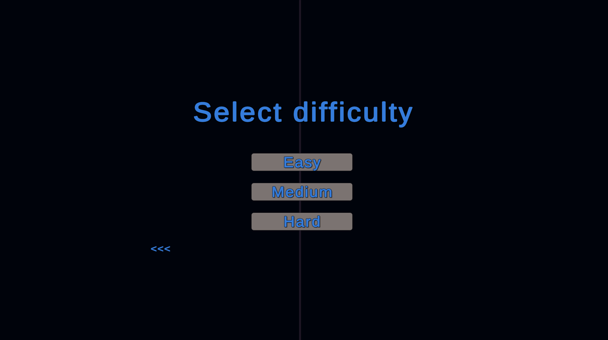
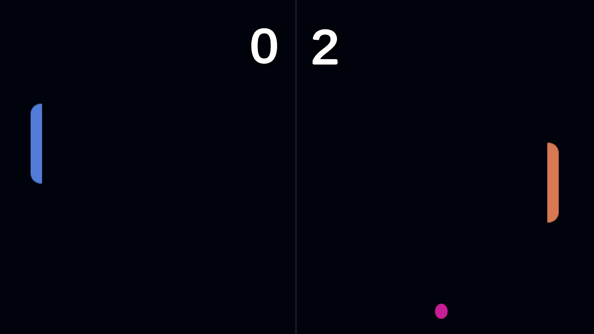
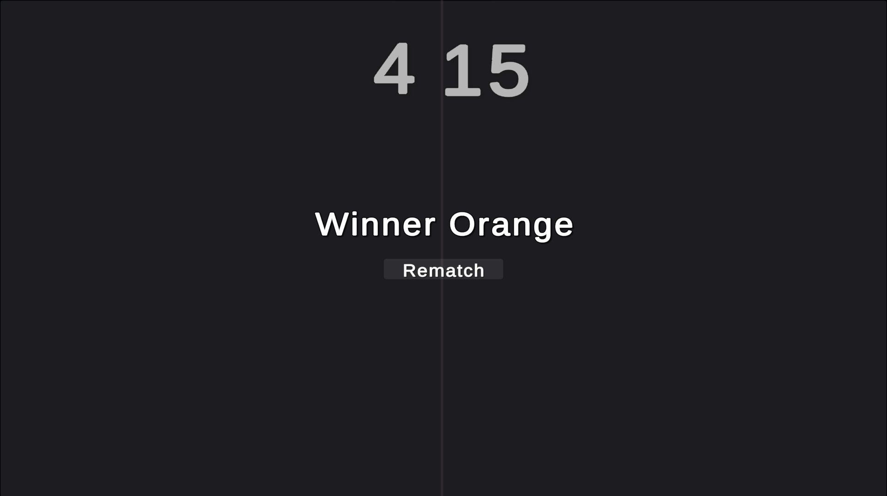

# Pong Game

Pong Game is a classic 2D arcade game created in Unity, offering both one-player and two-player modes, with varying difficulty levels (easy, medium, and hard) for one-player mode. The goal is to score 15 points to win.

## Screenshots

- Opening Screen
  

- Choose Difficulty
  

- Match Screen
  

- Winner Screen
  
  

## Gameplay Features

- Classic Pong gameplay with a modern twist.
- One-player and two-player modes available.
- Three difficulty levels: Easy, Medium, and Hard for one-player mode.
- The first player to score 15 points wins in two-player mode.
- Intuitive controls for paddle movement and ball direction.

## Gameplay Video

Check out the gameplay video on [YouTube](https://youtu.be/4jxF7Ow9m6o) to get a sneak peek of what Pong Game has to offer!

## How to Play

### One-Player Mode 

1. Choose the difficulty level (Easy, Medium, or Hard) on the "Choose Difficulty" screen.
2. Control your paddle using [up and down arrow] and try to score 15 points to win the game.
3. The AI opponent will challenge your skills, so be prepared for a dynamic game.

### Two-Player Mode

1. Grab a friend and challenge them to a two-player Pong match.
2. Player 1 controls their paddle using [w and s], and Player 2 uses [up and down arrow] for their paddle.
3. The first player to reach 15 points wins the game.

